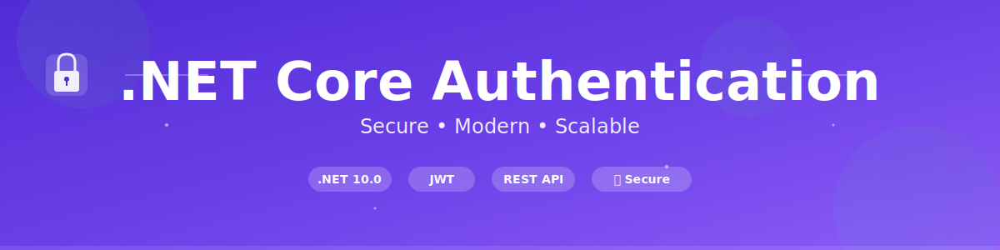
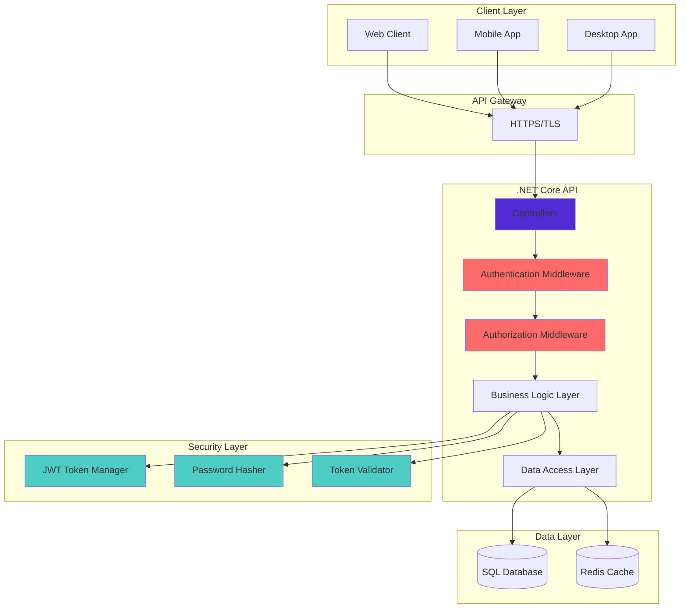
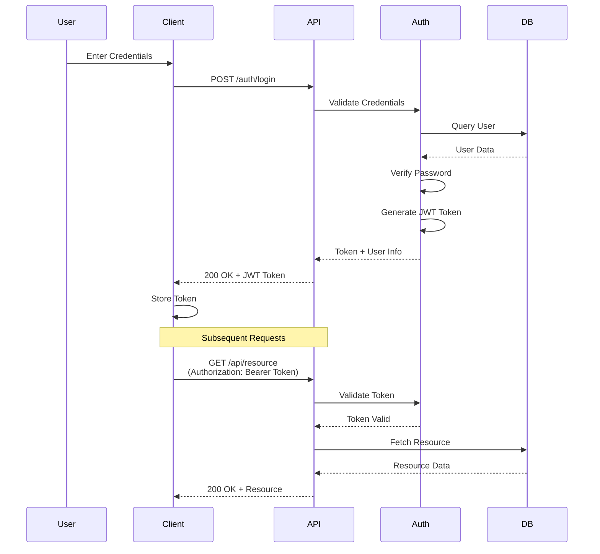

<div align="center">



# 🔐 .NET Core Authentication API

[](https://dotnet.microsoft.com/)
[](LICENSE)
[](https://docs.microsoft.com/en-us/dotnet/csharp/)
[](https://docs.microsoft.com/en-us/aspnet/core/)

**A modern, secure, and scalable authentication API built with .NET Core 10.0**

[Features](#-features) • [Getting Started](#-getting-started) • [Architecture](#-architecture) • [API Documentation](#-api-documentation) • [Contributing](#-contributing)

</div>

---

## 📋 Table of Contents

- [Overview](#-overview)
- [Features](#-features)
- [Architecture](#-architecture)
- [Technology Stack](#-technology-stack)
- [Getting Started](#-getting-started)
  - [Prerequisites](#prerequisites)
  - [Installation](#installation)
  - [Configuration](#configuration)
  - [Running the Application](#running-the-application)
- [API Documentation](#-api-documentation)
- [Security](#-security)
- [Project Structure](#-project-structure)
- [Contributing](#-contributing)
- [License](#-license)
- [Contact](#-contact)

---

## 🌟 Overview

.NET Core Authentication API is a robust, production-ready authentication service built on the latest .NET 10.0 framework. This project demonstrates best practices for implementing secure authentication mechanisms in modern web applications, providing a solid foundation for building secure APIs.

### Why This Project?

- ✨ **Modern Stack**: Built with .NET 10.0 and latest C# features
- 🔒 **Security First**: Implements industry-standard security practices
- 🚀 **Production Ready**: Scalable architecture suitable for enterprise applications
- 📚 **Well Documented**: Comprehensive documentation and code examples
- 🎯 **Clean Code**: Follows SOLID principles and clean architecture patterns

---

## ✨ Features

- 🔐 **JWT Authentication** - Secure token-based authentication
- 👤 **User Management** - Complete user registration and profile management
- 🔑 **Password Security** - Industry-standard password hashing and validation
- 📝 **OpenAPI/Swagger** - Interactive API documentation
- 🛡️ **Authorization** - Role-based access control (RBAC)
- 🔄 **Refresh Tokens** - Seamless token renewal mechanism
- 📧 **Email Verification** - Secure account verification workflow
- 🔒 **HTTPS Enforcement** - Secure communication by default
- ⚡ **High Performance** - Optimized for speed and scalability
- 🧪 **Testable** - Built with testing in mind

---

## 🏗️ Architecture

### System Architecture Diagram



### Authentication Flow



---

## 🛠️ Technology Stack

| Category | Technology |
|----------|-----------|
| **Framework** | .NET 10.0 |
| **Language** | C# 13 |
| **API Type** | RESTful API |
| **Documentation** | OpenAPI/Swagger |
| **Authentication** | JWT (JSON Web Tokens) |
| **Security** | ASP.NET Core Identity |
| **Database** | SQL Server / PostgreSQL |
| **ORM** | Entity Framework Core |
| **Caching** | Redis (Optional) |
| **Logging** | Serilog / NLog |
| **Testing** | xUnit / NUnit |

---

## 🚀 Getting Started

### Prerequisites

Before you begin, ensure you have the following installed:

- **[.NET SDK 10.0](https://dotnet.microsoft.com/download)** or higher
- **[Visual Studio 2025](https://visualstudio.microsoft.com/)** or **[VS Code](https://code.visualstudio.com/)** with C# extension
- **[SQL Server](https://www.microsoft.com/en-us/sql-server/sql-server-downloads)** or **[PostgreSQL](https://www.postgresql.org/download/)**
- **[Git](https://git-scm.com/downloads)**

### Installation

1. **Clone the repository**

```bash
git clone https://github.com/ZainulabdeenOfficial/dotnet-core-authentication.git
cd dotnet-core-authentication
```

2. **Navigate to the project directory**

```bash
cd "dotnet core authentication/dotnet core authentication"
```

3. **Restore dependencies**

```bash
dotnet restore
```

4. **Build the project**

```bash
dotnet build
```

### Configuration

1. **Update `appsettings.json`** with your configuration:

```json
{
  "ConnectionStrings": {
    "DefaultConnection": "Server=localhost;Database=AuthDB;Trusted_Connection=True;"
  },
  "Jwt": {
    "Key": "your-super-secret-key-min-32-characters",
    "Issuer": "your-issuer",
    "Audience": "your-audience",
    "ExpireMinutes": 60
  },
  "Logging": {
    "LogLevel": {
      "Default": "Information",
      "Microsoft.AspNetCore": "Warning"
    }
  },
  "AllowedHosts": "*"
}
```

2. **Run database migrations** (if applicable):

```bash
dotnet ef database update
```

### Running the Application

**Development Mode:**

```bash
dotnet run
```

**Production Mode:**

```bash
dotnet run --configuration Release
```

The API will be available at:
- **HTTPS**: `https://localhost:5001`
- **HTTP**: `http://localhost:5000`
- **Swagger UI**: `https://localhost:5001/swagger`

---

## 📚 API Documentation

### Authentication Endpoints

#### Register New User

```http
POST /api/auth/register
Content-Type: application/json

{
  "username": "johndoe",
  "email": "john@example.com",
  "password": "SecurePassword123!"
}
```

**Response:**
```json
{
  "success": true,
  "message": "User registered successfully",
  "userId": "123e4567-e89b-12d3-a456-426614174000"
}
```

#### Login

```http
POST /api/auth/login
Content-Type: application/json

{
  "email": "john@example.com",
  "password": "SecurePassword123!"
}
```

**Response:**
```json
{
  "success": true,
  "token": "eyJhbGciOiJIUzI1NiIsInR5cCI6IkpXVCJ9...",
  "refreshToken": "refresh_token_here",
  "expiresIn": 3600,
  "user": {
    "id": "123e4567-e89b-12d3-a456-426614174000",
    "email": "john@example.com",
    "username": "johndoe"
  }
}
```

#### Get Current User

```http
GET /api/auth/me
Authorization: Bearer {token}
```

**Response:**
```json
{
  "id": "123e4567-e89b-12d3-a456-426614174000",
  "username": "johndoe",
  "email": "john@example.com",
  "roles": ["User"]
}
```

### Swagger/OpenAPI

Interactive API documentation is available at `/swagger` when running in development mode.

---

## 🔒 Security

This project implements multiple layers of security:

- ✅ **HTTPS/TLS Encryption** - All data in transit is encrypted
- ✅ **JWT Token Authentication** - Secure, stateless authentication
- ✅ **Password Hashing** - Using industry-standard algorithms (bcrypt/PBKDF2)
- ✅ **CORS Policy** - Configured for secure cross-origin requests
- ✅ **Rate Limiting** - Protection against brute-force attacks
- ✅ **Input Validation** - All inputs are validated and sanitized
- ✅ **SQL Injection Prevention** - Using parameterized queries via EF Core
- ✅ **XSS Protection** - Output encoding and Content Security Policy

### Security Best Practices

1. **Never commit secrets** to version control
2. **Use environment variables** for sensitive configuration
3. **Rotate JWT secrets** regularly
4. **Implement token expiration** and refresh mechanisms
5. **Use HTTPS** in production
6. **Keep dependencies updated** to patch vulnerabilities

---

## 📁 Project Structure

```
dotnet-core-authentication/
├── dotnet core authentication/
│   ├── dotnet core authentication/
│   │   ├── Controllers/           # API Controllers
│   │   │   └── WeatherForecastController.cs
│   │   ├── Models/               # Data models and DTOs
│   │   ├── Services/             # Business logic services
│   │   ├── Data/                 # Database context and repositories
│   │   ├── Middleware/           # Custom middleware
│   │   ├── Properties/           # Launch settings
│   │   │   └── launchSettings.json
│   │   ├── Program.cs            # Application entry point
│   │   ├── appsettings.json      # Configuration
│   │   └── dotnet core authentication.csproj
│   └── dotnet core authentication.slnx
├── .gitignore
├── LICENSE
└── README.md
```

---

## 🤝 Contributing

Contributions are what make the open-source community such an amazing place to learn, inspire, and create. Any contributions you make are **greatly appreciated**.

### How to Contribute

1. **Fork the Project**
2. **Create your Feature Branch** (`git checkout -b feature/AmazingFeature`)
3. **Commit your Changes** (`git commit -m 'Add some AmazingFeature'`)
4. **Push to the Branch** (`git push origin feature/AmazingFeature`)
5. **Open a Pull Request**

### Contribution Guidelines

- Follow the existing code style and conventions
- Write clear, descriptive commit messages
- Add unit tests for new features
- Update documentation as needed
- Ensure all tests pass before submitting PR

---

## 📄 License

This project is licensed under the MIT License - see the [LICENSE](LICENSE) file for details.

---

## 📧 Contact

**Zainulabdeen Official**

- GitHub: [@ZainulabdeenOfficial](https://github.com/ZainulabdeenOfficial)
- Project Link: [https://github.com/ZainulabdeenOfficial/dotnet-core-authentication](https://github.com/ZainulabdeenOfficial/dotnet-core-authentication)

---

## 🙏 Acknowledgments

- [.NET Documentation](https://docs.microsoft.com/en-us/dotnet/)
- [ASP.NET Core Security](https://docs.microsoft.com/en-us/aspnet/core/security/)
- [JWT.io](https://jwt.io/)
- [OWASP Security Guidelines](https://owasp.org/)

---

<div align="center">

**⭐ If you found this project helpful, please consider giving it a star! ⭐**

Made with ❤️ by [Zainulabdeen Official](https://github.com/ZainulabdeenOfficial)

</div>